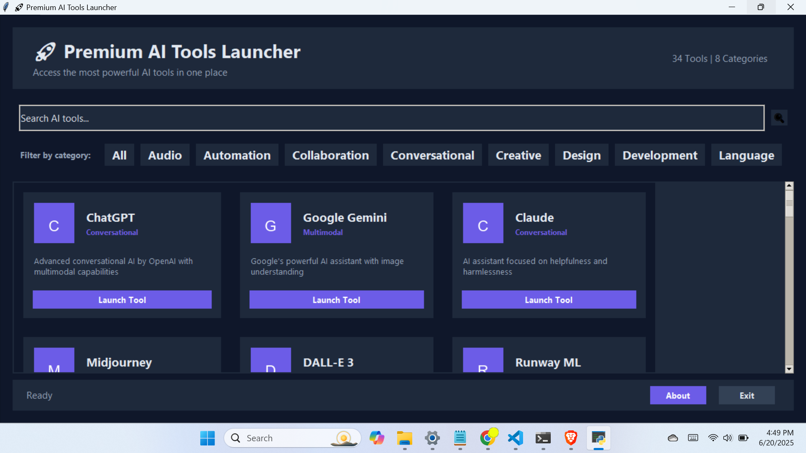

# AI Tools Launcher - Professional Desktop Application



# Software Icon 


## Overview

AI Tools Launcher is a professional desktop application that provides quick access to the most powerful AI tools available today. With a sleek, modern interface, you can easily browse, search, and launch your favorite AI platforms with a single click. The application features:

- **Intuitive Interface**: Clean, professional design with dark theme
- **Comprehensive Collection**: Access to 40+ top AI tools across 8 categories
- **Smart Filtering**: Search by name, description, or filter by category
- **One-Click Launch**: Open any tool directly in your default browser
- **Responsive Design**: Adapts to any screen size with dynamic layout
- **Windows Native**: Standalone executable that runs without installation

## Features

### 🚀 Tool Categories
- Conversational AI (ChatGPT, Claude, Gemini)
- Creative Tools (Midjourney, DALL-E, Runway ML)
- Writing Assistants (Grammarly, Jasper, Copy.ai)
- Productivity (Notion AI, Trello AI, Microsoft Copilot)
- Audio Tools (ElevenLabs, Suno AI)
- Research & Development (Perplexity, Anthropic Console)
- Video Creation (Synthesia, Pictory)
- And many more!

### 🔍 Smart Search & Filter
- Instant search by tool name or description
- Category filtering with visual "pills"
- Real-time results counter

### 🎨 Professional Interface
- Modern card-based layout with hover effects
- Clean typography with Segoe UI font
- Professional color scheme with purple accents
- Status bar with current selection information

## System Requirements

- **OS**: Windows 7, 8, 10, or 11 (64-bit)
- **RAM**: 4GB minimum (8GB recommended)
- **Disk Space**: 50MB free space
- **Display**: 1366x768 resolution or higher

## Installation

### Option 1: Download Pre-built Executable
1. Download the latest `AI_Tools_Launcher.exe` from the [Releases section](./dist/main.exe)
2. Save the file to your preferred location
3. Double-click to run (no installation required)

### Option 2: Build from Source
1. Clone the repository:
   ```bash
   git clone https://github.com/shiboshreeroy/ai-tools-launcher.git
   ```
2. Navigate to the project directory:
   ```bash
   cd ai-tools-launcher
   ```
3. Create a virtual environment (recommended):
   ```bash
   python -m venv venv
   venv\Scripts\activate
   ```
4. Install dependencies:
   ```bash
   pip install -r requirements.txt
   ```
5. Run the application:
   ```bash
   python main.py
   ```

## Building the Executable

To create a standalone Windows executable:

1. Install PyInstaller:
   ```bash
   pip install pyinstaller
   ```
2. Run the build script:
   ```bash
   python setup.py
   ```
3. The executable will be created in the `dist` folder

## Usage

1. **Launch the application** by double-clicking `AI_Tools_Launcher.exe`
2. **Browse tools** using the scrollable interface
3. **Search** for specific tools using the search bar
4. **Filter by category** using the category pills
5. **Click "Launch Tool"** to open any tool in your default browser

## Customization

You can easily customize the application by modifying the `AI_TOOLS` list in the source code:

```python
AI_TOOLS = [
    {
        "name": "Tool Name",
        "desc": "Tool description",
        "url": "https://tool.url",
        "icon": "icons/custom_icon.png",  # Optional
        "category": "Category Name"
    },
    # Add more tools as needed
]
```

## Troubleshooting

**Problem**: Application won't start  
**Solution**: Ensure you have the latest Visual C++ Redistributable installed

**Problem**: Icons not showing  
**Solution**: Place custom icons in the `icons` folder matching the tool names

**Problem**: Blank screen on launch  
**Solution**: Run the application with administrator privileges

## Contributing

We welcome contributions! Here's how you can help:

1. Fork the repository
2. Create a new branch for your feature/fix
3. Commit your changes
4. Push to your fork
5. Create a pull request

## License

This project is licensed under the MIT License - see the [LICENSE](LICENSE) file for details.

## Acknowledgments

- Inspired by the growing ecosystem of AI tools
- Built with Python, Tkinter, and PyInstaller
- Icons by Icons8 and Flaticon

---

**Get instant access to the most powerful AI tools today!**  
[Download Now](./dist/main.exe)